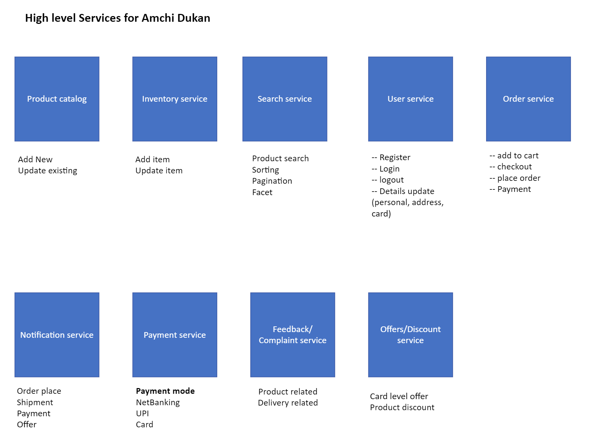
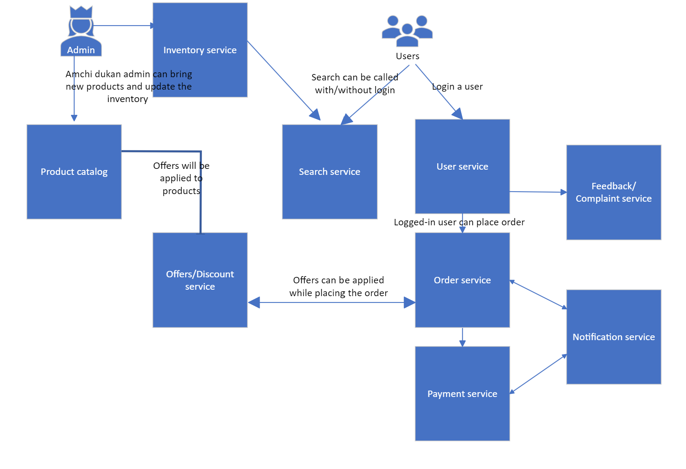

# EPE IDC Microservices 200 Session

**Introduction**

This is the repo spin up to have our EPE IDC Micrservices Level-200 session related materials and code that can be shared to participants.

**Description**

 Amchi Dukan can have many services but we have listed down few important ones below. It can vary case to case basis but for now we can define our domain within this. It will be difficult to create all these services in our hands-on session, so we have identified three basic ones which will suffice the initial lab session. 

**High level services**

  

**Communication between these services**

  

